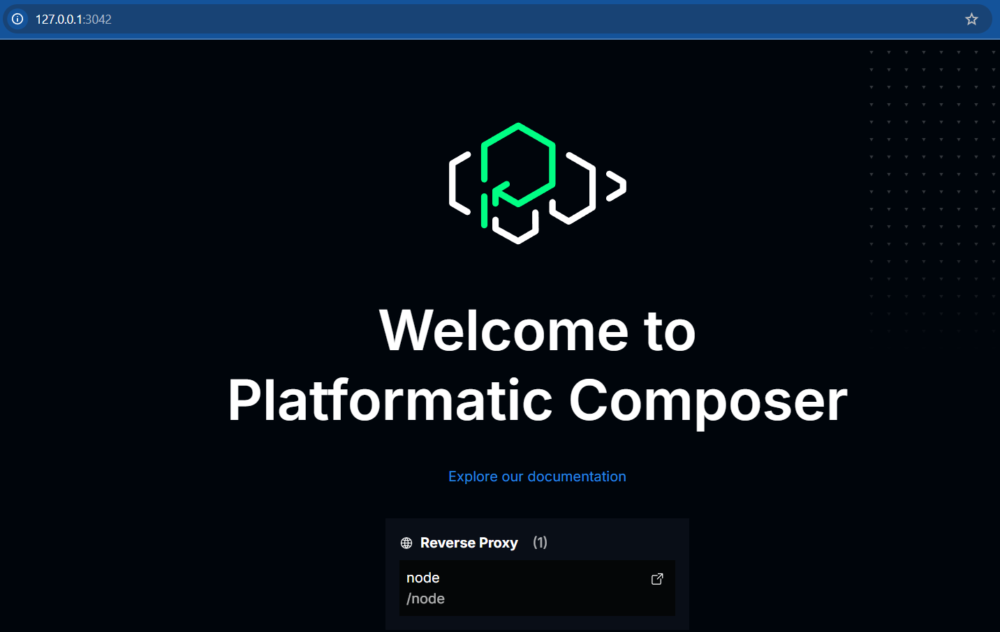
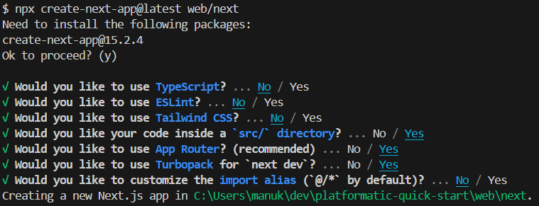

# Platformatic Quick Start

This is an intro to [Platformatic](https://platformatic.dev/), a Node.js App Server.

## 0. Stack

- **_Next.js_**
- Generic NodeJS app with `node:http createServer`
- **_Platformatic Composer_**, to coordinate/expose them all

## 1. Install Watt and Set up Node Server

- `npx wattpm@latest init`
- `mkdir web/node` and create the following files:
  - [package](./web/node/package.json)
  - [server](./web/node/server.js)
  - `npx wattpm import web/node`. This will update the `package.json` and generate the [watt](./web/node/watt.json) JSON file
- Run the server: `npm run dev`

## 2. Create a Platformatic Composer

- `npx create-platformatic`
  - ? Which kind of project do you want to create? `@platformatic/composer`
  - ? What is the name of the service? `composer`
  - ? Do you want to create another service? `no`
  - ? Do you want to use TypeScript? `no`
  - ? Do you want to init the git repository? `no`
- Run the server again: `npm run dev`. This will display the URL for the composer: 

> _NOTES_:
> <br><li> If you add `/node` to the URL, you will trigger the Node Server. This time the count will increase by 1 instead of 2, as expected: http://127.0.0.1:3042/node/ <br><li> You can customize how the various services are exposed by changing the [composer config](./web/composer/platformatic.json)

## 3. Create a Frontend App with NextJS

- `npx create-next-app@latest web/next`
  
- Import it into the Watt Server: `npx wattpm import web/next` && `npm i`
- Update [Watt](./web/next/watt.json) to expose `next` server on `/next` path:

  ```json
  "application": {
      "basePath": "/next"
    }
  ```

- Run the Next App: `npm run dev`

HERE: [17:10:18.399] ERROR (next/1676) <STDERR>: ÔÜá Lockfile was successfully patched, please run "npm install" to ensure @next/swc dependencies are downloaded
